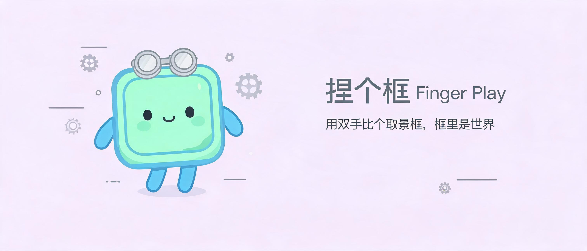

<div align="center">
  <h1>✌️ 捏个框 · Finger Play</h1>
  <p><em>用双手比个取景框，框里是世界 —— 摄像头 + 手指框 + AI 滤镜，录出爆款手指交互视频。</em></p>
</div>

<p align="center">
  <a href="README.md"></a>
  <a href="README_EN.md"></a>
  <a href="LICENSE"></a>
  <a href="https://finger-play.gokuscraper.com"></a>
  
  
</p>

<!-- 📸 Banner -->
<p align="center"></p>

捏个框是一款纯前端的手指交互视频工具：打开摄像头，用双手比出取景框，17 种滤镜、贴图头像、AI 风格化全都在浏览器里实时生效。先录制，再合成，导出即发抖音。

## 为什么选它？

- **纯浏览器本地运行** —— 无后端、无账号、无上传，视频与手部数据全程不出设备
- **手比框，实时滤镜** —— 手指画的框内套滤镜，框外露原画，17 种效果（负片 / 故障 / 印象派 / 极光 / 矩阵 / RGB残影 / 绿幕…）
- **贴图头像不露脸** —— 人脸追踪 + 透明头像贴图，录视频不想露脸也能出片
- **录制即导出** —— 支持 MP4（Safari / 新 Chrome）与 WebM，10 秒快捷录制
- **合成模式 AI 风格化** —— 上传原视频 + AI 重绘视频，AI 世界透过手指框露出来
- **手机可用** —— PWA 安装、竖屏全屏自动旋转铺满、移动端抽屉滤镜面板

## 对比：剪映手动做 vs 捏个框

| 维度 | 剪映 / CapCut 等商业工具手动做 | 捏个框 |
|------|:---:|:---:|
| 做出「手指框效果」耗时 | 逐帧抠图 + 打关键帧，数小时 | 摄像头一开，手一比框即成 |
| 实时预览 | ⚠️ 素材剪辑，非实时追踪 | ✅ 框内滤镜实时生效 |
| 贴图头像 / 不露脸 | 手动抠脸，麻烦 | ✅ 一键贴图头像 |
| 本地隐私 | ❌ 素材上传云端 | ✅ 全程本地，不上传 |
| 价格 | 会员 / 水印 | 免费开源 |
| 学习门槛 | 中高 | 低（开摄像头即可） |

## 快速开始

任意静态服务器即可运行：

```bash
python3 -m http.server 8125
```

打开 http://localhost:8125，允许摄像头权限，把手伸进画面比个框。

在线体验：<https://finger-play.gokuscraper.com>

## 使用

### 录制模式（在线，默认）

1. 点「🎥 录制」→「📷 开启摄像头」
2. 双手比出取景框，或只比一个框
3. 选滤镜模式：**单选** / **双选**（左右手交叉 = A/B 两个滤镜）/ **四指**（3 个指缝区各自滤镜）/ **全能**（自动识别）
4. 可开启「🙈 贴图头像」盖住脸、「🖐 手部检测点」可视化、「🔄 镜像」
5. 点「⏺ 录制」或「⏺ 录10秒」，下载 MP4 / WebM 视频

### 合成模式（双上传）

1. 用录制模式或任意工具录下「比框手势」原视频
2. 用 `stylize.py` 把视频 AI 重绘成目标风格（动漫 / 3D 动画 / 黏土…）
3. 回到应用切「✨ 合成」，上传原视频 + AI 风格化视频
4. MediaPipe 在原视频上逐帧追踪手指框，AI 世界透过虚线蚂蚁线取景框露出来，导出成片

### 离线 CLI（Python）

风格化与合成也可以完全在本地脚本完成：

```bash
python3 -m venv .venv
.venv/bin/pip install -r requirements.txt

export GEMINI_API_KEY=...
.venv/bin/python stylize.py input.mp4 -o stylized.mp4      # AI 重绘
.venv/bin/python composite.py input.mp4 stylized.mp4 -o final.mp4
```

`composite.py` 需要 `ffmpeg` 在 PATH 中，输出 H.264 MP4 并保留原音轨。

## 工作原理

- **手部追踪**：MediaPipe Hand Landmarker 在缩小的检测画布上跑（快），把 21 点归一化坐标映射到固定 1280×720 画布
- **手指框**：解剖学角点排序（交叉手 = 蝴蝶结双三角）、张开 / 面积门限带回滞、跳变拒绝、速度自适应平滑、丢帧保持、出现淡入
- **滤镜**：CamanJS 调色 + Canvas 2D 程序化特效（印象派 / 极光 / 矩阵…），头像与手指在滤镜之前进场景，所以框内滤镜对它们同样生效（换脸 = 滤镜同样生效）
- **合成模式**：追踪原视频手指框，把 AI 视频通过取景框露出来；两段分辨率不一致时拉伸铺满取景框

## 贡献与开发

```bash
npm install        # 安装 Playwright
npm test           # 跑 32 个自动化测试（smoke.spec.js）
```

想改代码？直接改 `app.js` / `index.html` / `styles.css`，加功能请保持测试覆盖。

## 支持 / 捐赠

我养了两只猫，汤圆和饺子。如果你觉得捏个框给你的生活带来了快乐，你可以喂它们 [罐头食品 🥩](https://ko-fi.com/gokuscraper)。

## License

[GPL v2](LICENSE) — Copyright (C) 2026 Goku Scraper

---

*Keywords: 手指交互, 手指框, 捏个框, 滤镜, MediaPipe, 手部追踪, 贴图头像, 绿幕, 视频录制, 抖音, PWA, 纯前端, finger frame, hand tracking, finger gesture, video filters, avatar sticker, greenscreen, canvas 2d, realtime effects, 人工智能, AI 视频*
