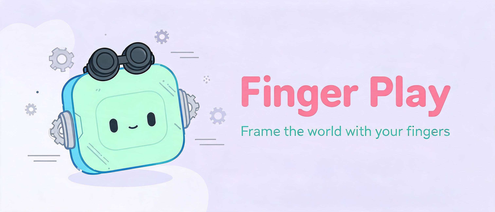

<div align="center">
  <h1>✌️ Finger Play</h1>
  <p><em>Frame the world with your fingers — camera + finger frame + AI filters, record viral finger-interaction videos.</em></p>
</div>

<p align="center">
  <a href="README.md"></a>
  <a href="README_EN.md"></a>
  <a href="LICENSE"></a>
  <a href="https://finger-play.gokuscraper.com"></a>
  
  
</p>

<!-- 📸 Banner -->
<p align="center"></p>

Finger Play is a pure-frontend finger-interaction video tool. Open your camera, frame a rectangle with your hands, and 17 filters, avatar stickers and AI restyling all take effect in the browser in real time. Record first, composite next, export and post.

## Why Finger Play?

- **Runs fully in the browser** — no backend, no account, no uploads; video and hand data never leave your device
- **Finger frame, live filters** — effects apply inside the frame your fingers draw, original video stays outside; 17 effects (invert / glitch / impressionism / aurora / matrix / RGB ghosting / greenscreen…)
- **Avatar stickers, no face shown** — face tracking + transparent avatar overlay, record without showing your face
- **Record and export** — MP4 (Safari / modern Chrome) and WebM, with a 10-second quick record
- **Composite mode with AI restyling** — upload the original clip and an AI-restyled clip, and the AI world shows through your finger frame
- **Mobile friendly** — PWA installable, portrait fullscreen auto-rotates to fill the screen, drawer-style filter panel on phones

## Comparison: Manual CapCut vs Finger Play

| Aspect | Manual with CapCut / commercial tools | Finger Play |
|--------|:---:|:---:|
| Time to make the "finger frame" effect | Cutouts + keyframes per frame, hours | Camera on, hands frame it, done |
| Live preview | ⚠️ asset editing, no live tracking | ✅ filters apply live in-frame |
| Avatar / hide face | Manual cutout | ✅ one-click avatar sticker |
| Local privacy | ❌ footage uploaded to cloud | ✅ all local, no upload |
| Price | Membership / watermark | Free and open source |
| Learning curve | Medium-high | Low (open camera) |

## Quick start

Any static server works:

```bash
python3 -m http.server 8125
```

Open http://localhost:8125, allow camera access, and frame your hands in front of the lens.

Try it online: <https://finger-play.gokuscraper.com>

## Usage

### Record mode (online, default)

1. Tap "🎥 Record" → "📷 Open Camera"
2. Frame a rectangle with both hands
3. Pick a filter mode: **Single** / **Dual** (hands crossed = filter A/B) / **Four fingers** (3 gaps, one filter each) / **Auto** (detect automatically)
4. Optional: "🙈 Avatar Sticker" to cover your face, "🖐 Hand points" visualization, "🔄 Mirror"
5. Tap "⏺ Record" or "⏺ Record 10s", download MP4 / WebM

### Composite mode (two uploads)

1. Record the "finger-frame gesture" source clip (in-app or any tool)
2. AI-restyle it to a target style with `stylize.py` (anime / 3D animation / clay…)
3. Switch to "✨ Composite", upload the source clip and the AI-restyled clip
4. MediaPipe tracks the finger frame frame-by-frame on the source, and the AI world shows through the marching-ants viewfinder; export the final video

### Offline CLI (Python)

Restyling and compositing can also run fully as local scripts:

```bash
python3 -m venv .venv
.venv/bin/pip install -r requirements.txt

export GEMINI_API_KEY=...
.venv/bin/python stylize.py input.mp4 -o stylized.mp4      # AI restyle
.venv/bin/python composite.py input.mp4 stylized.mp4 -o final.mp4
```

`composite.py` needs `ffmpeg` on PATH and outputs H.264 MP4, carrying over the original audio track when present.

## How it works

- **Hand tracking**: MediaPipe Hand Landmarker runs on a small detection canvas (fast), mapping 21 normalized landmarks onto a fixed 1280×720 canvas
- **Finger frame**: anatomical corner ordering (crossed hands = bow-tie dual triangles), spread/area gates with hysteresis, teleport rejection, velocity-adaptive smoothing, dropout hold, presence fade
- **Filters**: CamanJS color grading + procedural Canvas 2D effects (impressionism / aurora / matrix…); the avatar and hands enter the scene before filters, so in-frame filters apply to them too
- **Composite mode**: tracks the finger frame on the source clip and reveals the AI video through the viewfinder; mismatched resolutions stretch the AI video to fill the frame

## Contributing & development

```bash
npm install        # install Playwright
npm test           # run 32 automated tests (smoke.spec.js)
```

Want to contribute? Edit `app.js` / `index.html` / `styles.css` directly; keep tests covering any new feature.

## Support / Donate

I have two cats, Tangyuan and Jiaozi. If Finger Play brought a bit of joy to your life, you can feed them [canned food 🥩](https://ko-fi.com/gokuscraper).

## License

[GPL v2](LICENSE) — Copyright (C) 2026 Goku Scraper

---

*Keywords: finger frame, finger gesture, hand tracking, MediaPipe, video filters, avatar sticker, greenscreen, video recording, douyin, tiktok, PWA, pure frontend, canvas 2d, realtime effects, AI video, 手指交互, 手指框, 捏个框, 滤镜, 手部追踪, 贴图头像, 绿幕*
